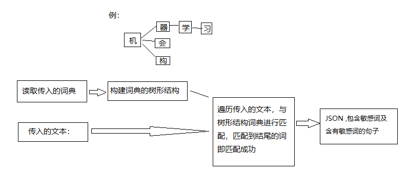

# 算法实现逻辑

## 

## 一、功能

自定义敏感词检测 : 用户自定义要检测的敏感词，构成词典集合，对传入待处理的文本进行检测，返回敏感词及包含敏感词的句子列表。

## 二、交互方式

提供http接口

## 三、应用场景

可根据传入的words精确匹配传入待处理content中是否含有words中的词，并返回含有words中词的句子集合，可作为对含有敏感度较高词的文本内容的精确匹配。

## 四、逻辑图
